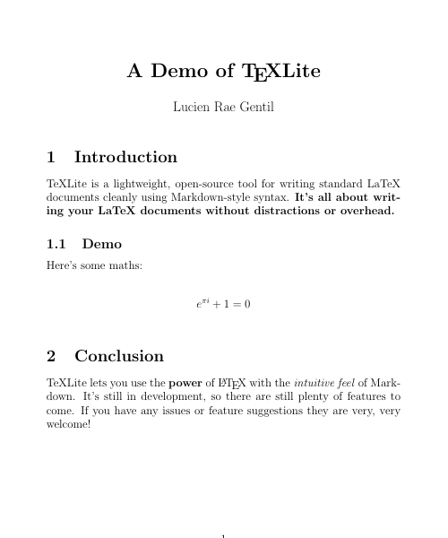

<p align="center">
  
</p>

[](https://pypi.org/project/texlite)    

> TeXLite is a lightweight, open-source tool for writing standard LaTeX documents cleanly using Markdown-style syntax. **It's all about writing your LaTeX documents without distractions or overhead.**

# Example

|   |   |
|:--:|:--:|
| Document | PDF |

:smile: Note that **all LaTeX commands can be used seamlessly as valid TeXLite**, even from [external packages](https://github.com/lucrae/texlite/blob/master/docs/guide.md#document-setup).

# Get Started

## Installation

**STEP 1**: Install `texlite` with [pip](https://pip.pypa.io/en/stable/quickstart/).

```
$ pip install --upgrade texlite
```

**STEP 2**: Install (if not already installed) a [distribution of TeX](https://www.latex-project.org/get/). Recommendations:

- On Windows, *MikTeX* can be installed from [its official downloads page](https://miktex.org/download).

- On MacOS, *MacTeX* can be installed with `brew cask install mactex`.

- On Ubuntu/Debian, *TeX Live* can be installed with `sudo apt-get install texlive`.

You should now be able to run `$ texlite` (see [Usage](#usage)). If you have any issues, refer to [Installation Fixes](#installation-fixes).

## Usage

To compile your document to PDF, open the terminal and execute:

```
$ texlite my_document.md
```

where `my_document.md` is the path to your document. *Note that on Windows you may need to use `python -m texlite my_document.md` instead, (see [Installation Fixes](#installation-fixes) for more info).*

Use `texlite --help` for options and information. 

## Writing

:blue_book: The [guide](https://github.com/lucrae/texlite/blob/master/docs/guide.md) provides a concise but comprehensive run-down on all you need to know, with examples included.

## Advanced Usage

### Document Setup

Document setup options can be specified with tags at the start of the document. For example:

```
:title: My Document  
:usepackages: xcolor, hyperref 
```

The lines above will set the document title to "My Document" and allow the document to use commands from the `xcolor` and `hyperref` LaTeX packages (given they're installed).

All the meta specification tags can be found in the guide [here](https://github.com/lucrae/texlite/blob/master/docs/guide.md#document-setup).

### Saving as LaTeX/TeX

TeXLite "transpiles" to TeX, so it's very easy to save the `.tex` with:

```
$ texlite --save-tex my_document.md
```

Or if you want just the `.tex` and no PDF:

```
$ texlite --no-pdf my_document.md
```
  
# Contributing

> TeXLite is still in development and has plenty of features and fixes yet to come! If you can help with that, no matter to what degree, contributions to the project are greatly appreciated.

**For example, you can become a credited contributer to the project by:**

- Adding ideas for the project to [Issues](https://github.com/lucrae/texlite/issues).
- Adding new components (as simple as adding a module to `texlite/components` and then adding it to `parse.py`).
- Fixing bugs, or trying to break TeXLite to discover bugs (go to [Issues](https://github.com/lucrae/texlite/issues)).
- Writing documentation or examples (super appreciated!).

**Notes on contributing:**

- If you're new to contributing, that's okay! Refer to [this great guide](https://akrabat.com/the-beginners-guide-to-contributing-to-a-github-project/) on how to get started.

- Go to [Issues](https://github.com/lucrae/texlite/issues) to report any bugs, suggest any features, or see what contributions are currently in need.

- Before and after implementing features, run tests on your local build with `$ tox` and lint with `$ tox -e lint`. Pull requests will not be accepted if not passing tests.

# Other

## License

TeXLite is licensed under [GNU GPL v3](https://www.gnu.org/licenses/gpl-3.0.en.html). You are essentially free to use this software in any way you want (privately, commercially, with modifications, etc.) on the condition that distributions stay open-source and stick to the license.

## Installation Fixes

If you're having issues with installing TeXLite, here are some fixes to possible problems:

- **TeXLite not added to Windows PATH**: On Windows, Pip will not automatically add programs to your PATH (meaning that TeXLite can't be executed with `$ texlite`). Try calling TeXLite instead with `python -m texlite` or `python3 -m texlite`, or adding Python/TeXLite to your PATH.

- **Wrong Python**: If `pip install texlite` is not working, you may be using Python 2.7, which has reached its end of life. Use `pip3 install --upgrade pip` and then `pip3 install texlite` to ensure that you're using Python 3.

- **TeX Live Missing Packages**: If *TeX Live* is installed and working but the document TeX cannot be compiled, it may because of missing plugins. You can ensure your *TeX Live* has all the plugins with `sudo apt-get install texlive-full`.

- **MikTeX Missing Packages**: When first running *MikTeX* on Windows, you may still need to install LaTeX packages. To easily install all that are missing, run `texlite` and wait for a prompt. In the prompt there's a checkbox to do this automatically, which may require you to wait but then it should fix your problems.
