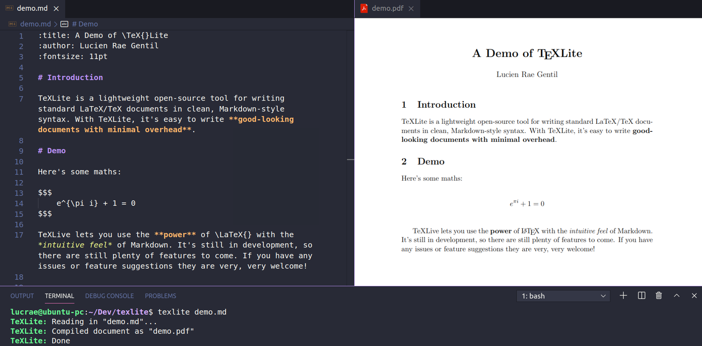

<p align="center">
  
</p>

[](https://pypi.org/project/texlite)    

> TeXLite is a lightweight open-source tool for writing standard LaTeX/TeX documents in clean, Markdown-style syntax. **With TeXLite, it's easy to write good-looking documents with minimal overhead**.

<p align="center">
  
  <p align="center"><i>A demo of writing a simple document in an editor and compiling it to a PDF with TeXLite</i></p>
</p>

# Install

**STEP 1**: Install and upgrade with [pip](https://pip.pypa.io/en/stable/quickstart/).

```
$ pip install --upgrade texlite
```

**STEP 2**: Install (if not already installed) a [distribution of TeX](https://www.latex-project.org/get/). Recommendations:
- On Windows, *MikTeX* can be installed from [its official downloads page](https://miktex.org/download).
- On MacOS, *MacTeX* can be installed with `brew cask install mactex`.
- On Ubuntu/Debian, *TeX Live* can be installed with `sudo apt-get install texlive`.

You should now be able to compile your documents into PDFs with:

```
$ texlite my_document.md
```

(Or with `python -m texlite my_document.md` if on Windows).

Use `texlite --help` for options and information. If you have any issues installing, refer to [Installation Fixes](#installation-fixes).

# Get Started

A run-down on all you need to know is in [this concise guide](https://github.com/lucrae/texlite/blob/master/docs/guide.md).

# Contributing

> TeXLite is still in development and has plenty of features and fixes yet to come! If you can help with that, no matter to what degree, contributions to the project are greatly appreciated.

**For example, you can become a credited contributer to the project by:**

- Adding ideas for the project to [Issues](https://github.com/lucrae/texlite/issues).
- Adding new components (as simple as adding a module to `texlite/components` and then adding it to `parse.py`).
- Fixing bugs, or trying to break TeXLite to discover bugs (go to [Issues](https://github.com/lucrae/texlite/issues)).
- Writing documentation or examples (super appreciated!).

**Notes on contributing:**

- If you're new to contributing, that's okay! Refer to [this great guide](https://akrabat.com/the-beginners-guide-to-contributing-to-a-github-project/) on how to get started.
- Go to [Issues](https://github.com/lucrae/texlite/issues) to report any bugs, suggest any features, or see what contributions are currently in need.
- Before and after implementing features, run tests on your local build with `$ tox` and lint with `$ tox -e lint`. Pull requests will not be accepted if not passing tests.

# Other

## License

TeXLite is licensed under [GNU GPL v3](https://www.gnu.org/licenses/gpl-3.0.en.html). You are essentially free to use this software in any way you want (privately, commercially, with modifications, etc.) on the condition that distributions stay open-source and stick to the license.

## Installation Fixes

If you're having issues with installing TeXLite, here are some fixes to possible problems:

- **Not added to Windows PATH**: On Windows PowerShell or CMD, Pip will not automatically add programs to your PATH (meaning that TeXLite can't be executed with `$ texlite`). You can fix this either by adding texlite to your PATH, or simply by calling TeXLite with `python -m texlite` or `python3 -m texlite`.

- **Wrong Python**: If `pip install texlite` is not working, you may be using Python 2.7, which has reached its end of life. Use `pip3 install --upgrade pip` and then `pip3 install texlite` to ensure that you're using Python 3.

- **TeX Live Missing Packages**: If *TeX Live* is installed and working but the document TeX cannot be compiled, it may because of missing plugins. You can ensure your *TeX Live* has all the plugins with `sudo apt-get install texlive-full`.

- **MikTeX Missing Packages**: When first running *MikTeX* on Windows, you may still need to install LaTeX packages. To easily install all that are missing, run `texlite` and wait for a prompt. In the prompt there's a checkbox to do this automatically, which may require you to wait but then it should fix your problems.
